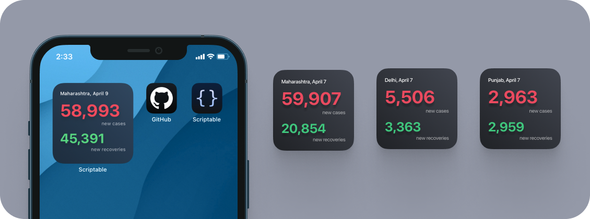
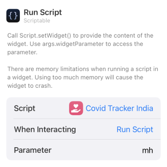

## Covid Tracker India - Widget
Shows the latest number of newly confirmed cases and no of revcovered patients from any state in India.

---

## 🙇 Why i made this?
A perfect blend of boredom and fear of second wave lead to the creation of this.

---

## 📖 How to use?
1. **Download** [scriptable app](https://apps.apple.com/in/app/scriptable/id1405459188).
2. **Download** the [Covid Tracker India.js](./Covid%20Tracker%20India.js) script.
3.  **Transfer** the downloaded script to the "scriptable" folder on iCloud Drive which should have been created upon downloading of the app.
4. **Long press** anywhere to enter the "jiggle mode" and click on "**+**" sign present on the top left of your screen. **Scroll down** until you find the Scriptable app and click on it.
5. Select widget size (preferable small widget) and click on **[+ Add widget]**
6. Configure the newly added widget as [given below](#️-configure). 

---

## ⚙️ Configure
**Long press** on the widget and click on **Edit Widget ⓘ**

| Options        | Defaults |  Change to |      
| :------------- |:------------- |:-------------|
| Script     | Choose | Covid Tracker India|
| While Interacting (optional)  | Open App | Run Script |
| Parameters | Text | State Code eg. "mh" for Maharashtra, "pb" for Punjab.defaults to maharashtra |
Like so for Maharashtra:

---

## ✍️ Feedback
If you have any feature request or feedback on this feel free to DM me on [Twitter](https://twitter.com/DharmiKumbhani) or mail me at <dharmikumbhani201@gmail.com>
widgets that can help us passively learn things should not be just limited to facts; but to various other domains as well, if you have any such idea in mind, feel free to reach out to me! 

--- 

## 🔮 Future updates planned with this widget
Based on response and other time based factors my current plan includes:
- [ ] Add district wise support.

---

## ⭐️ Other Credits:
This widget uses the [COVID19-India API](https://api.covid19india.org) which is an [open source](https://github.com/covid19india) initiative.

---

  Made with 💙 for fun 😉 - DK

