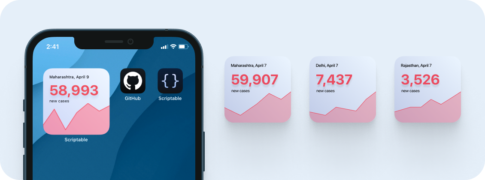
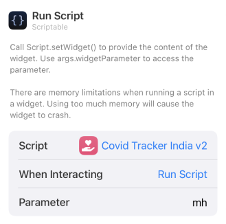

## Covid Tracker v2 India - Widget
Displays the latest number of confirmed cases for any state in India along with a graph depicting the trend for the number of cases for the last 7 days.

 

## 🙇 Why i made this?
After making the [first version](./../Covid%20Tracker%20-%20India) i was experimenting with other designs and figured this would make for a beautiful widget + the mathematics of programming the graph on the widget excited me; hence.

 

## 📖 How to use?
1. **Download** [scriptable app](https://apps.apple.com/in/app/scriptable/id1405459188).
2. **Download** the [Covid Tracker India v2.js](./Covid%20Tracker%20India%20v2.js) script.
3.  **Transfer** the downloaded script to the "scriptable" folder on iCloud Drive which should have been created upon downloading of the app.
4. **Long press** anywhere to enter the "jiggle mode" and click on "**+**" sign present on the top left of your screen. **Scroll down** until you find the Scriptable app and click on it.
5. Select widget size (preferable small widget) and click on **[+ Add widget]**
6. Configure the newly added widget as [given below](#️-configure). 

 

## ⚙️ Configure
**Long press** on the widget and click on **Edit Widget**

| Options        | Defaults |  Change to |      
| :------------- |:------------- |:-------------|
| Script     | Choose | Covid Tracker India v2|
| While Interacting (optional)  | Open App | Run Script |
| Parameters | Text | State Code eg. "mh" for Maharashtra, "pb" for Punjab.defaults to maharashtra |

Like so for Maharashtra:

 

## ✍️ Feedback
If you have any feature request or feedback on this feel free to DM me on [Twitter](https://twitter.com/DharmiKumbhani) or mail me at <dharmikumbhani201@gmail.com>
widgets that can help us passively learn things should not be just limited to facts; but to various other domains as well, if you have any such idea in mind, feel free to reach out to me! 

 

## 🔮 Future updates planned with this widget
Based on response and other time based factors my current plan includes:
- [ ] Add district vise support.
- [ ] Experiment with linear gradient instead of a solid red (Once the needful functionality is added)

 

## ⭐️ Other Credits:
This widget uses the [COVID19-India API](https://api.covid19india.org) which is an [open source](https://github.com/covid19india) initiative.

 

  Made with 💙 for fun 😉 - DK

