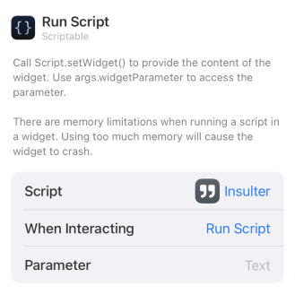

## Insulter - Widget
Gives you a well deserved insult.

 

## 🙇 Why i made this?
Even i am not sure why.  

 

## 📖 How to use?
1. **Download** [scriptable app](https://apps.apple.com/in/app/scriptable/id1405459188).
2. **Download** the [Insulter.js](./Insulter.js) script.
3.  **Transfer** the downloaded script to the "scriptable" folder on iCloud Drive which should have been created upon downloading of the app.
4. **Long press** anywhere to enter the "jiggle mode" and click on "**+**" sign present on the top left of your screen. **Scroll down** until you find the Scriptable app and click on it.
5. Select widget size (preferable medium widget) and click on **[+ Add widget]**
6. Configure the newly added widget as [given below](#️-configure).  

 

## ⚙️ Configure
**Long press** on the widget and click on **Edit Widget ⓘ**

| Options        | Defaults |  Change to |      
| :------------- |:------------- |:-------------|
| Script     | Choose | Insulter|
| While Interacting (optional)  | Open App | Run Script |
| Parameters | Text | NA |
Like so:
  

 

## ✍️ Feedback
If you have any feature request or feedback on this feel free to DM me on [Twitter](https://twitter.com/DharmiKumbhani) or mail me at <dharmikumbhani201@gmail.com>
widgets that can help us passively learn things should not be just limited to facts; but to various other domains as well, if you have any such idea in mind, feel free to reach out to me!  

 

## 🔮 Future updates planned with this widget
Based on response and other time based factors my current plan includes:
- [ ] Delete this stupid widget.  

 

## ⭐️ Other Credits:
This widget uses the [Evil Insults](https://evilinsult.com) API which is an [open source](https://github.com/EvilInsultGenerator/) initiative.  

 

---

  Made with 💙 for fun 😉 - DK

