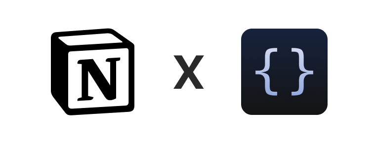
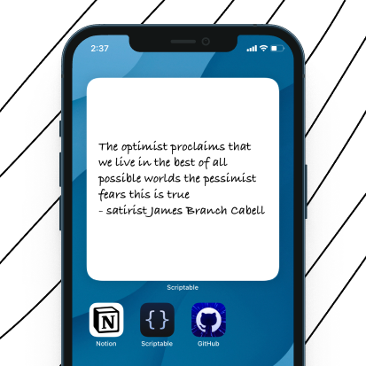

# Notion x Scriptable Integration

 

## Table of Contents
  - [❏ List of widgets](#-list-of-widgets)
    - [re-reads](#re-reads)
  - [📖 How to use scriptable widgets?](#-how-to-use-scriptable-widgets)
  - [✍️ Feedback](#️-feedback)

 

## [re-reads](https://github.com/dharmikumbhani/scriptable/tree/main/)

Brings your re-reads (quotes, phrases, one liners from books you found while reading a book) to you **passively** instead of having to actively take time out and going through them.