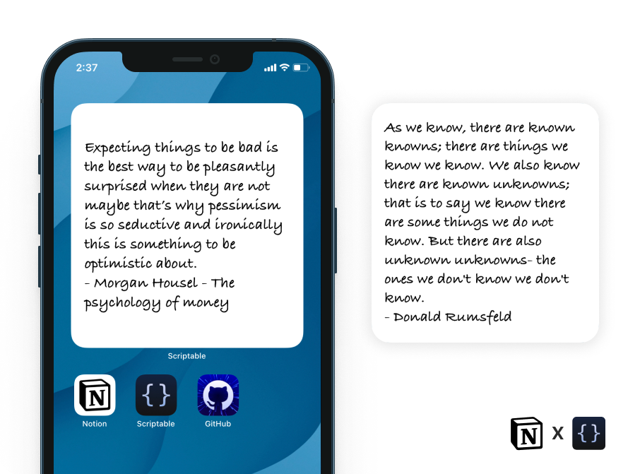
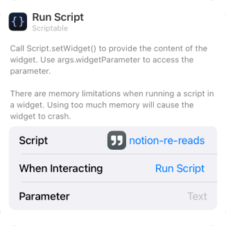

## Notion - Widget
Brings your re-reads (quotes, phrases, one liners from books you found while reading a book) to you **passively** instead of having to actively take time out and going through them.

 

## 🙇 Why i made this?
The list of profound quotes and phrases that i had come across was increasing daily and although i was diligent enough to type them down immediately in notion but was too lazy to find and schedule specific time for going through them. 
I needed a way where these re-reads would come to me instead me having to actively take time out to go through all of them. 
Hence this widget was made to passively, intermiddently and randomly get me a random re-read that i had typed down.

 

## 📖 How to use?
1. **Download** [scriptable app](https://apps.apple.com/in/app/scriptable/id1405459188).
2. **Download** the [notion-re-reads.js](./notion-re-reads.js) script.
3. **Transfer** the downloaded script to the "scriptable" folder on iCloud Drive which should have been created upon downloading of the app.
4. Go to [developers.notion](https://developers.notion.com) and click on **MY INTEGRATIONS**.
5. Create a **NEW INTEGRATION** copy the secrete token and paste it inside the double quotes for the variable name **BEARER_TOKEN** inside your notion-re-reads.js file.
6. Now go to the your notion page where you have all your re-reads and click on **SHARE** and **ADD** the recent integration you made by clicking on invite.
7. After adding the integration directly copy link to that page (or try: ⌘+L for mac) and paste it inside the double quotes of the variable **NOTION_LINK** inside your notion-re-reads.js file.
8. Now the final steps of adding the widget to your home screen:
    
   **Long press** anywhere to enter the "jiggle mode" and click on "**+**" sign present on the top left of your screen. **Scroll down** until you find the Scriptable app and click on it.
9.  Select widget size (preferable large widget) and click on **[+ Add widget]**
10. Configure the newly added widget as [given below](#️-configure).  

 

## ⚙️ Configure
**Long press** on the widget and click on **Edit Widget ⓘ**
 
Depending on the parameter the widget will display any of the selected type. i.e if you choose the parameter as "quote" then you will get a random quotes that is there in your notion page.

| Options        | Defaults |  Change to |
| :------------- |:------------- |:-------------|
| Script     | Choose | notion-re-reads|
| While Interacting (optional)  | Open App | Run Script |
| Parameters | Text | "paragraph", "heading_1", "heading_2", "heading_3", "bulleted_list_item", "numbered_list_item", "to_do" |

Like so:

 

## 👨🏻‍💻 How i use this in my workflow
1. While reading as soon as I come across something profound and feel it could be a great phrase to add it to my vocabulary, i immediately add it to my notion page as a quote.. I call that page Communications Development.
2. Thats it. Now i let the widget do its work and be rest assured that sometime in future i will surely read it again.

 

## ✍️ Feedback
If you have any feature request or feedback on this feel free to DM me on [Twitter](https://twitter.com/DharmiKumbhani) or mail me at <dharmikumbhani201@gmail.com>
widgets that can help us passively learn things should not be just limited to facts; but to various other domains as well, if you have any such idea in mind, feel free to reach out to me! 

 

## 🔮 Future updates planned with this widget
Based on response and other time based factors my current plan includes:
- [ ] Add Support for randomly selecting from multiple parameters types (quotes + bulleted_list_item, etc).

 

## ⭐️ Other Credits:
This widget uses the [Notion](https://developers.notion.com) API.

 

---

  Made with 💙 for fun 😉 - DK

