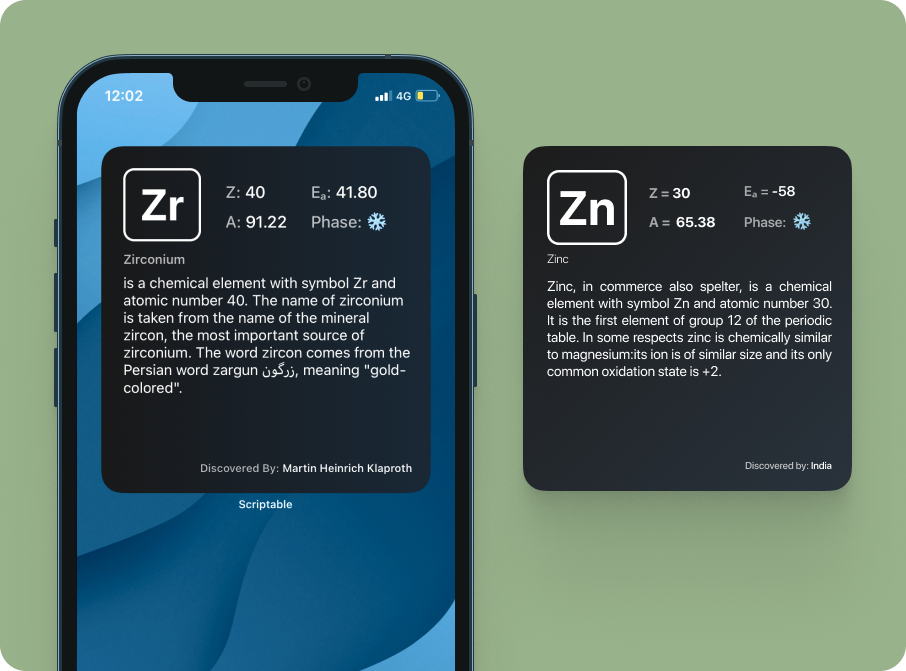
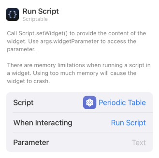

## Periodic Table (Elements) - Widget
This widget after every some interval randomly chooses one of 119 elements and displays useful information about it, things like:
1. Symbol,
2. Number (Z),
3. Atomic Mass (A),
4. Electron Affinity (Eₐ),
5. Phase
   -  Solid - ❄️
   -  Liquid - 💧
   -  Gaseous - ♨️
6. Name of Element,
7. Short Summary on it and
8. Discovered By

 

## 🙇 Why i made this?
> Widgets could be a great way to consume information passively

And what better information than the one thats actually gonna be useful for your final Chemistry exam!
I remember during my high school when i had to learn these elements; it was less of a memory and more of a scare. My teachers tried making us learn these elements using lots of acronyms but i still used to forget them; there were bloddy 118 of them during my time. 
A suggestion I got from my teacher was, take a big printout of the entire periodic table and stick it somewhere on the wall above your bed and spend 5 minutes reading through it before going off to sleep. 
Theoretically this suggestion was great but practically for me it proved quiet useless! I used to end up playing Call of Duty late at night with friends and sleep; spending the last 5 minutes before sleeping looking at the black mirror.

 

## 📖 How to use?
1. **Download** [scriptable app](https://apps.apple.com/in/app/scriptable/id1405459188).
2. **Download** the [Periodic Table.js](./Periodic%20Table.js) script.
3.  **Transfer** the downloaded script to the "scriptable" folder on iCloud Drive which should have been created upon downloading of the app.
4. **Long press** anywhere to enter the "jiggle mode" and click on "**+**" sign present on the top left of your screen. **Scroll down** until you find the Scriptable app and click on it.
5. Select widget size (preferable large widget) and click on **[+ Add widget]**
6. Configure the newly added widget as [given below](#️-configure). 

 

## ⚙️ Configure
**Long press** on the widget and click on **Edit Widget ⓘ**

| Options        | Defaults |  Change to |      
| :------------- |:------------- |:-------------|
| Script     | Choose | Periodic Table|
| While Interacting (optional)  | Open App | Run Script |
| Parameters | Text | NA |

Like so:

 

## ✍️ Feedback
If you have any feature request or feedback on this feel free to DM me on [Twitter](https://twitter.com/DharmiKumbhani) or mail me at <dharmikumbhani201@gmail.com>
widgets that can help us passively learn things should not be just limited to periodic tables; but to various other subjects as well, if you have any such idea in mind, feel free to reach out to me! 

 

## 🔮 Future updates planned with this widget
Based on response and other time based factors my current plan includes:
- [ ] Change background color depending on light and dark mode
- [ ] Loop through all the elements in order one after the other
- [ ] Control the refresh rate, so one can set it to refresh element daily.

 

## ⭐️ Other Credits:
This script uses the [periodic table json](https://github.com/Bowserinator/Periodic-Table-JSON) made by [Bowserinator](https://github.com/Bowserinator) as it's source.

 

---

  Made with 💙 for fun 😉 - DK

