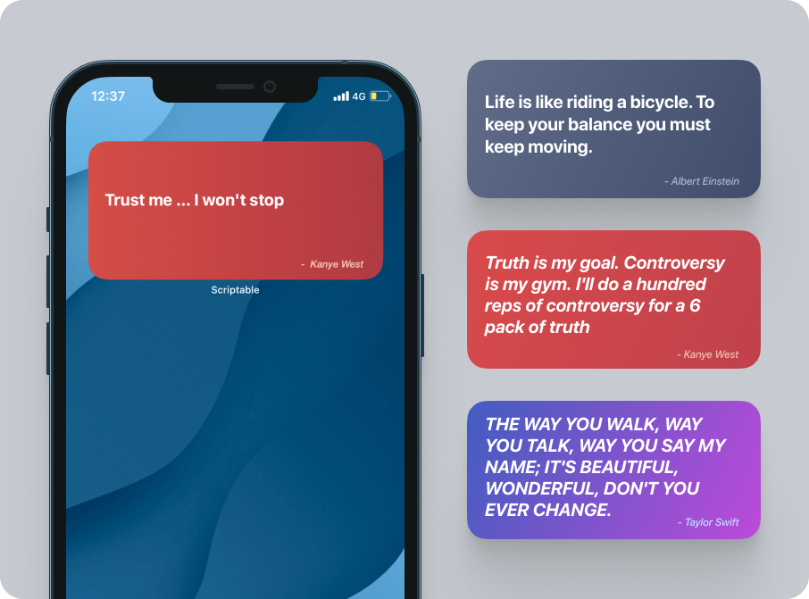
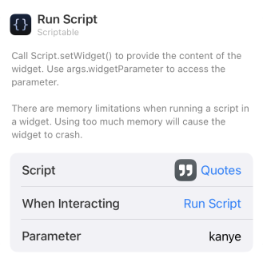

## Quotes - Widget
This widget after every some interval gets you an illuminating quote:

 

## 🙇 Why i made this?
I just came across scriptable and was intrigued by it. I have no idea about swift/objective-c but was working with javascript for quiet some time and thought this could be a great way to enter the realm of Automation and iOS development + i feel widgets are super cool!

 

## 📖 How to use?
1. **Download** [scriptable app](https://apps.apple.com/in/app/scriptable/id1405459188).
2. **Download** the [Quotes.js](./Quotes.js) script.
3.  **Transfer** the downloaded script to the "scriptable" folder on iCloud Drive which should have been created upon downloading of the app.
4. **Long press** anywhere to enter the "jiggle mode" and click on "**+**" sign present on the top left of your screen. **Scroll down** until you find the Scriptable app and click on it.
5. Select widget size (preferable medium widget) and click on **[+ Add widget]**
6. Configure the newly added widget as [given below](#️-configure). 

 

## ⚙️ Configure
**Long press** on the widget and click on **Edit Widget ⓘ**

| Options        | Defaults |  Change to |      
| :------------- |:------------- |:-------------|
| Script     | Choose | Quotes|
| While Interacting (optional)  | Open App | Run Script |
| Parameters | Text | "kanye" for quotes from Kanye West, "taylor" for quotes from Taylor Swift, defaults to "general" |

Like so:

 

## ✍️ Feedback
If you have any feature request or feedback on this feel free to DM me on [Twitter](https://twitter.com/DharmiKumbhani) or mail me at <dharmikumbhani201@gmail.com>
widgets that can help us passively learn things should not be just limited to facts; but to various other domains as well, if you have any such idea in mind, feel free to reach out to me! 

 

## 🔮 Future updates planned with this widget
Based on response and other time based factors my current plan includes:
- [ ] Add other famous people on the list

 

## ⭐️ Other Credits:
The General Quotes are presented to you with the help of [quotable](https://api.quotable.io) is used. For Kanye West quotes, [Kanye Rest](https://kanye.rest/) made by [Andrew Jazbec](https://github.com/ajzbc/kanye.rest) is used and for Taylor Swift quotes, [Taylor Rest](https://taylor.rest/) made by [Gilles](https://github.com/gillescoolen/taylor.rest) is used.

 

  Made with 💙 for fun 😉 - DK

