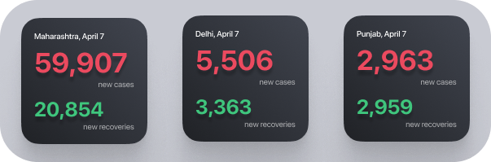
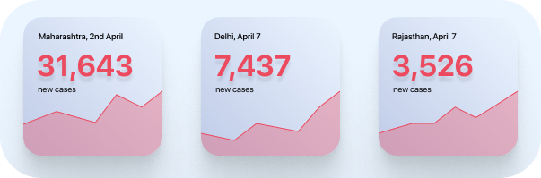
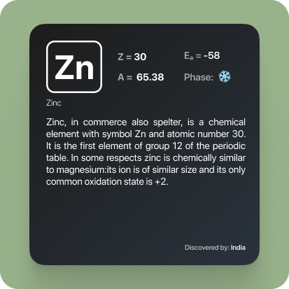

# Scriptable - scripts and wigets for iOS 
Collection of widgets and scripts made using scriptable app for iOS

 &nbsp; 

 <!--  -->

Scriptable is an app that lets you add cool, lightweight widgets as well as automation to your apple devices.

 

## Table of Contents
  - [❏ List of widgets](#-list-of-widgets)
    - [Covid Tracker India](#covid-tracker-india)
    - [Covid Tracker India v2](#covid-tracker-india-v2)
    - [Insulter](#insulter)
    - [Periodic Table](#periodic-table)
    - [Quotes](#quotes)
    - [Random Number Fact](#random-number-fact)
  - [📖 How to use scriptable widgets?](#-how-to-use-scriptable-widgets)
  - [✍️ Feedback](#️-feedback)

 

## ❏ List of widgets
### [Covid Tracker India](https://github.com/dharmikumbhani/scriptable/tree/main/Covid%20Tracker%20-%20India)
 

Shows the latest number of newly confirmed cases and no of revcovered patients from any state in India.

### [Covid Tracker India v2](https://github.com/dharmikumbhani/scriptable/tree/main/Covid%20Tracker%20v2%20-%20India)

Displays the latest number of cofirmed cases for any state in India along with a graph depciting the trend for the number of cases for the last 7 days.

### [Insulter](https://github.com/dharmikumbhani/scriptable/tree/main/Insulter)

Petty self explanatory - Gives you a well deserved insult.

### [Periodic Table](https://github.com/dharmikumbhani/scriptable/tree/main/Periodic%20Table)

Get details about an element from the periodic table

### [Quotes](https://github.com/dharmikumbhani/scriptable/tree/main/Quotes)
 

Shows a random quote from famous people like Alber Einstein, John Wolfgang von Goethe 

### [Random Number Fact](https://github.com/dharmikumbhani/scriptable/tree/main/Random%20Number%20Fact)
 

Well gives you a rather intresting fact adout a randomly generated number.

 

## 📖 How to use scriptable widgets?
1. Download the [scriptable app](https://apps.apple.com/in/app/scriptable/id1405459188).
2. Check if the scriptable folder is created  have created a folder having the name "scriptable" in your iCloud drive.
3. Download the .js script of the respective widget and add it to that scriptable folder.
4. Long Press anywhere on screen, click on "+" icon, select scriptable app and click on add widget with the size depending on the widget you choose.
5. "**edit widget ⓘ**" by long pressing it to change the following configurations:
    | Options        | Defaults |  Change to |      
    | ------------- |:------------- |:-------------|
    | Script     | Choose | Select widget |
    | While Interacting (optional)  | Open App | Run Script |
    | Parameters | Text | Configurable options, depending on widgets  |
6. More info and configurable options (if any) are availble in the respective folders of widgets.

 

## ✍️ Feedback
If you have any feature/widget request or feedback on this feel free to DM me on [Twitter](https://twitter.com/DharmiKumbhani) or mail me at <dharmikumbhani201@gmail.com>
widgets that can help us passively learn things should not be just limited to facts; but to various other domains as well, if you have any such idea in mind, feel free to reach out to me! 

 

---

  Made with 💙 for fun 😉 - DK

